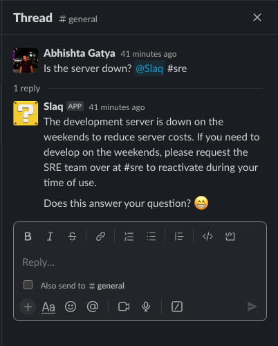

# Slaq 

> Answering Frequently-Slacked Questions



Status: **Work In Progress**

Slaq is a Slackbot that answers questions it knows in your Workspace. It works by using a Sentence Transformer to match your query to a knowledge base. This app is currently available to install independently at your own risk. 

[View Changelog](CHANGELOG.md)

## Prerequisite

If you are trying to install this bot on your server, make sure to follow this tutorial to get you configured on Slack. [Learn Here](https://api.slack.com/start/building/bolt-python)

## Quick Start

```bash
~ pip install -r requirements.txt
~ python main.py
```

Docker Deployments : TBA

## Author
* Abhishta Gatya ([Email](mailto:abhishtagatya@yahoo.com)) - Software and Machine Learning Engineer
